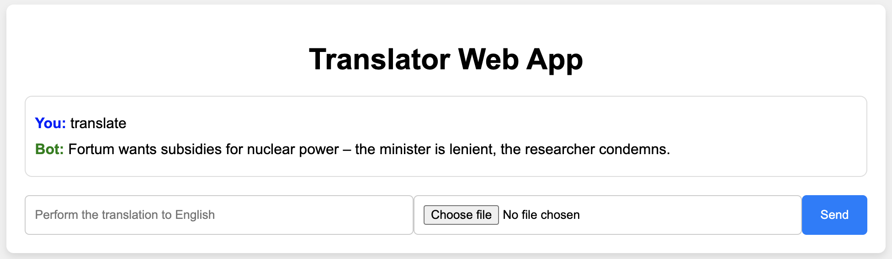

# summarizer

This web application, built with the Flask framework, is designed to allow users to interact with long documents in two key ways:

Translation: Users can input a document or text and have it translated into English language.

Chatting: Users can also engage in real-time conversations about the content of long documents. The chat functionality may include interactive features like asking questions about the document's content or discussing specific sections.



## Run the application

### Prerequisites

|Entity|version|
|------|-------|
|Python|`3.12.0`|
|pip   |`3`    |
|Azure OpenAI||
|Model|`o3-mini`|

#### Prepare the environment
1. Obtain all the needed dependencies
```
pip3 install -r requirements.txt
```
2. Copy and add the secrets to `.env` file
```
cp .env.template .env
vi .env
```

### Start the application locally
1. Run the application with flask on port `8080` with debug
```
python -m flask run --port 8080 --debug
```

2. Check the application at [http://localhost:8080](http://localhost:8080)